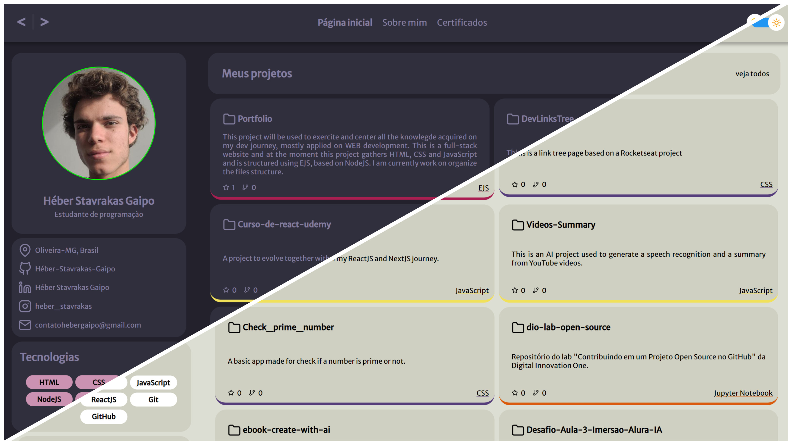

<h1 align="center">Portfolio</h1>


---

<p align="center">Projeto destinado a concentrar e apresentar meus conhecimentos de programação, voltados ao desenvolvimento WEB.</p>

<p align="center">
  <a href="#tecnologias">Tecnologias</a>&nbsp;&nbsp;&nbsp;|&nbsp;&nbsp;&nbsp;
  <a href="#projeto">Projeto</a>&nbsp;&nbsp;&nbsp;|&nbsp;&nbsp;&nbsp;
  <a href="#desafio-alura">Desafio Alura</a>&nbsp;&nbsp;&nbsp;|&nbsp;&nbsp;&nbsp;
  <a href="#home">Página Inicial</a>&nbsp;&nbsp;&nbsp;|&nbsp;&nbsp;&nbsp;
  <a href="#about">Sobre mim</a>&nbsp;&nbsp;&nbsp;|&nbsp;&nbsp;&nbsp;
  <a href="#certificates">Certificados</a>&nbsp;&nbsp;&nbsp;|&nbsp;&nbsp;&nbsp;
  <a href="#features">Features</a>
</p>

---

<a href="https://youtu.be/u2FLoC7SmRU" aLign="center">
  <p>👆 Clique para ver o Portfólio</p>
  
</a>

<h2 id="tecnologias">Tecnologias</h2>

- HTML
- CSS
- JavaScript
  - Axios
  - Express
  - Node.js

<h2 id="projeto">Projeto</h2>

Esse projeto nasceu com a proposta de aplicar e desenvolver meus conhecimentos em HTML e CSS, para apresentar uma página inicial que servisse como portfólio. Mas decidi reunir aqui conhecimentos mais profundos, tanto HTML e CSS, quanto JavaScript e suas ferramentas.

O site conta com uma página inicial para exibir meu projetos públicos no GitHub através de requisição em API, uma seção que falo sobre mim de forma breve, porém contextual e por último, mas não menos importante, uma seção para meus certificados, que vão sendo inseridos conforme adquiridos.

Esse README exibe uma apresentação estática e mais prática. O vídeo no início do documento apresenta alguns recursos extras como efeitos em ```:hover```, ```:focus```, um botão de "voltar ao topo" com efeito smooth quando clicado, um theme-switcher e requisições em APIs. O site também conta com media queries.

<h2 id="desafio-alura">Desafio Alura</h2>

Participei da Imersão Alura - Inteligência Artificial 2ª Edição, foi apresentado o Gemini e o todas as possibilidades que ele oferece.

O primeiro desafio envolve implementar a IA Generativa Gemini ou Google AI Studio, ambos da Google, para automatizar tarefas realizadas pelos alunos, em trabalhos pessoais. Enfim, o objetivo era explorar a ferramenta para desenvolver algo.

Decidi usar a IA para me ajudar a automatizar a exibição dos certificados na respectiva seção, buscando as informações desses certificados dentro das pastar e utilizar NodeJS com EJS na função ```forEach()``` para enviar essas informações para o front-end, seguindo o mesmo princípio desenvolvido por mim na Página Inicial, mas dessa vez sem a necessidade de uma API externa.

## Prompt

É possível fazer uma função forEach com ejs para imprimir na tela cada uma de umas imagens dispostas em uma pasta local?

## Saídas

1. Estrutura do projeto:
```java
my_project/
├── views/
│   └── index.ejs
├── public/
│   └── images/
│       ├── image1.jpg
│       ├── image2.jpg
│       └── image3.jpg
├── app.js
└── package.json
```

2. Código do Servidor (app.js):
```JS
const express = require('express');
const path = require('path');
const fs = require('fs');

const app = express();
const port = 3000;

// Definindo a pasta pública para servir arquivos estáticos
app.use(express.static(path.join(__dirname, 'public')));

// Configurando a view engine como EJS
app.set('view engine', 'ejs');

app.get('/', (req, res) => {
  const imagesDir = path.join(__dirname, 'public', 'images');
  
  // Lendo os arquivos da pasta de imagens
  fs.readdir(imagesDir, (err, files) => {
    if (err) {
      return res.status(500).send('Erro ao ler o diretório de imagens.');
    }

    // Filtrando apenas arquivos de imagem (opcional)
    const images = files.filter(file => /\.(jpg|jpeg|png|gif)$/i.test(file));

    // Renderizando a view e passando a lista de imagens
    res.render('index', { images });
  });
});

app.listen(port, () => {
  console.log(`Servidor rodando em http://localhost:${port}`);
});
```

3. Template EJS (views/index.ejs):
```HTML
<!DOCTYPE html>
<html lang="en">
<head>
  <meta charset="UTF-8">
  <meta name="viewport" content="width=device-width, initial-scale=1.0">
  <title>Galeria de Imagens</title>
</head>
<body>
  <h1>Galeria de Imagens</h1>
  <div>
    <% images.forEach(image => { %>
      " alt="<%= image %>" style="width: 200px; height: auto;">
    <% }); %>
  </div>
</body>
</html>
```

## Resultado

A partir do exemplo disposto pela IA, construí os códigos a seguir
```JS
const path = require("path");
const fs = require("fs");
const { getRepos } = require("./services");

const CERTIFICATES_DIR = path.join(__dirname, "src", "public", "certificates");

const readCertificates = (dir) => {
  return new Promise((resolve, reject) => {
    fs.readdir(dir, (err, files) => {
      if (err) {
        return reject(`Erro ao ler o diretório: ${dir}`);
      }
      const certificates = files.filter((file) => /\.(jpg|jpeg|png|gif)$/i.test(file));
      resolve(certificates);
    });
  });
};

function routes(app) {

  // Main page and About page routes before

  app.get("/certificate", async (req, res) => {
    try {
      const rocketseatCertificates = await readCertificates(path.join(CERTIFICATES_DIR, "rocketseat"));
      const dioCertificates = await readCertificates(path.join(CERTIFICATES_DIR, "dio"));

      res.render("certificates.ejs", { rocketseatCertificates, dioCertificates });
    } catch (error) {
      res.status(500).send(error);
    }
  });
}

module.exports = routes;

```

```HTML
<% rocketseatCertificates.forEach(function(certificate) {%>
<div class="certificates" title="Abrir certificado">
  <div onclick="enlargeImage(this)">
    "
      alt="<%=certificate%>"
      id="<%=certificate.split('.')[0]%>"
      class="certificate img"
    />
  </div>
</div>
<%}) %>

<!-- Code continue -->

<% dioCertificates.forEach(function(certificate) {%>
<div class="certificates" title="Abrir certificado">
  <div onclick="enlargeImage(this)">
    "
      alt="<%=certificate%>"
      id="<%=certificate.split('.')[0]%>"
      class="certificate img"
    />
  </div>
</div>
<%}) %>
```

<div aLign="center" style="display: flex; flex-direction: row; justify-content: center; align-items: center; gap:2rem">
  <a href="./routes.js"></a>
  <a href="./src/views/certificates.ejs"></a>
</div>

---

<h2 id="home">Página Inicial</h2>

<h3 style="text-decoration: underline;">Tema claro</h3>

.png>)

<h3 style="text-decoration: underline;">Tema escuro</h3>

.png>)

<h2 id="about">Sobre mim</h2>

<h3 style="text-decoration: underline;">Tema claro</h3>

.png>)

<h3 style="text-decoration: underline;">Tema escuro</h3>

.png>)

<h2 id="certificates">Certificados</h2>

<h3 style="text-decoration: underline;">Tema claro</h3>

.png>)

<h3 style="text-decoration: underline;">Tema escuro</h3>

.png>)

<h2 id="features">✨Features</h2>

- Switch Theme
- Back-to-top button
- CSS Effects and Media Queries
- API Requests
- Google Gemini
